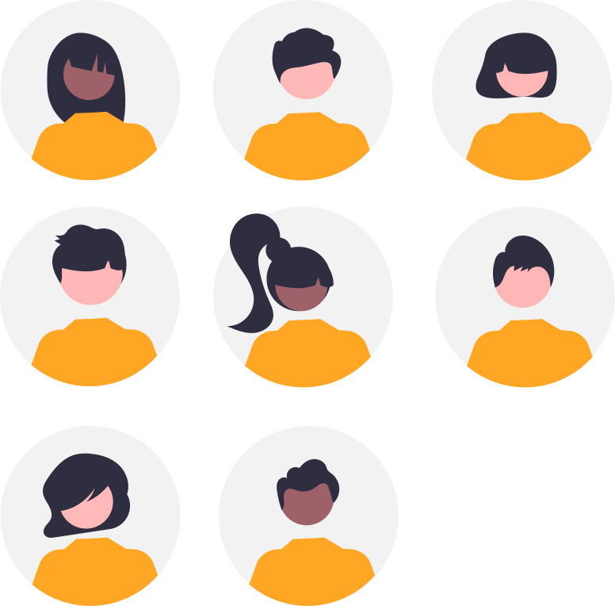

## Avertissement :

[{: align=left width=10%}](https://teams.microsoft.com/l/team/19%3asG1oNl14DTd40cjgqxwpYChIRicdveWklGmxU3s7zHs1%40thread.tacv2/conversations?groupId=8dbbb2d2-7711-4619-8174-1f4748cb0f58&tenantId=3a7994d7-1ce5-426f-a6e3-eee0616e2a6c){target=_blank}[{: align=right width=10%}](mailto:team-1nsi-20212022@ecmorlaix.fr){target=_blank}Ce site s'adresse au groupe des élèves de première du lycée Notre Dame du Mur qui suivent l'enseignement de spécialité Numérique et Sciences Informatiques.

### Autres liens du groupe :

- [Sharepoint](https://ecmorlaix.sharepoint.com/sites/TEAM-1NSI-20212022/Documents%20partages/Forms/AllItems.aspx?CT=1633088990185&RootFolder=%2Fsites%2FTEAM%2D1NSI%2D20212022%2FDocuments%20partages%2FGeneral&FolderCTID=0x012000019689D1FEC0FB4E86F4D05CA2B5A0EC){target=_blank}
- [Conversation](https://outlook.office365.com/mail/group/ecmorlaix.fr/team-1nsi-20212022/email){target=_blank}

***

{: .center width=50%}

[mail]: mailto:eric.madec@ecmorlaix.fr "eric.madec@ecmorlaix.fr"

<!-- A venir :

- Présenter un worflow pour tenir un classeur numérique de notebook : GitHub + iPad + serveur jupyterHub Gesis (+ jupyter{book} ?)

- Présentation de différentes solutions de développement pour l'apprentissage de la programmation : Notebook avec Basthon ou Carnets, python tutor, Basthon Console, REPL, ...

-->

## Le 26/04

- **faire** les activités du notebook [IHM_Web_Statique](./IHM_Web_Statique) et rendre compte de votre travail ;

### Complément :

- **regarder** la vidéo [Notions de web et d'interface homme-machine](https://www.lumni.fr/video/notions-de-web-et-d-interface-homme-machine){target="_blank"} ;

### Révisions :

- **regarder** la vidéo [Les dictionnaires en Python](https://www.lumni.fr/video/les-dictionnaires){target="_blank"} ;

- **regarder** la vidéo [Notion de listes en informatique et application aux images numériques](https://www.lumni.fr/video/notion-de-listes-en-informatique-et-application-aux-images-numeriques){target="_blank"} ;

- **regarder** la vidéo [L'architecture des réseaux et les protocoles de communications](https://www.lumni.fr/video/l-architecture-des-reseaux-et-les-protocoles-de-communications){target="_blank"}

***

## Le 05/04

- Correction des activités du notebook [Traitement de données en table avec Python (Partie 1)​](./Data_CSV-1) ;
- **faire** les activités du notebook [Traitement de données en table avec Python (Partie 2)​](./Data_CSV-2) et rendre compte de votre travail ;

## Le 22/03

- Révisions SNT, initiation au traitement de données en table à l'adresse [https://concours.castor-informatique.fr/](https://concours.castor-informatique.fr/){target="_blank"} avec les codes :
    - ​Séance 1 : ​tnytsuxu
    - Séance 2 : ut7rekw3​​
    - Séance 3 : 3fhjqjnj

- **faire** les activités du notebook [Traitement de données en table avec Python (Partie 1)​](./Data_CSV-1) et rendre compte de votre travail ;

## Le 18/03

- Evaluation par [QCM](https://genumsi.inria.fr/qcm.php?h=949c61042231bf1dc02842e8a772694f){target="_blank"}

## Le 15/03

- **faire** les [Exercices sur les listes​ (tableaux)](./Exercices_listes) et rendre compte de votre travail ;

## Le 25/02 :

- Se **connecter** sur [edublocks](https://app.edublocks.org/){target="_blank"} avec votre compte Microsoft ECMorlaix, **rejoindre** la salle de classe 1NSI avec le code `PqKM` et faire la tâche `HelloWorld_NSI`assigner.
- **finir** les activités du notebook [BBCmicrobit-Un_BN_Pour_MicroPython](./BBCmicrobit-Un_BN_Pour_MicroPython) et rendre compte de votre travail ;
- - **commencer** les activités des notebooks [Les_tableaux](./Les_tableaux) et [TP_matrices](./TP_matrices)

## Les 22 et 23/02 :

- **faire** les activités du notebook [BBCmicrobit-Un_BN_Pour_MicroPython](./BBCmicrobit-Un_BN_Pour_MicroPython) et rendre compte de votre travail ;

## Le 04/02 :

- Evaluation par QCM ;

## Les 01 et 02/02

- **faire** les activités du notebook [Logique Booleenne](./Logique_Booleenne) et rendre compte de votre travail ;
> Complément, exemples de réalisations de fonctions logiques avec des transistors,  
reconnaitre les fonctions simulées :
>
>    - <https://tinyurl.com/y6ca4dwn>{target="_blank"} ;
>    - <https://tinyurl.com/y62j9dxj>{target="_blank"} ;
>    - <https://tinyurl.com/y4pmexnc>{target="_blank"} ;
>    - <https://tinyurl.com/yya89b6n>{target="_blank"} ;
>    - <https://tinyurl.com/y56od8rh>{target="_blank"}...  
>    Ces circuits utilisent des transistors bipolaires inventés en 1948.
>    [Aujourd'hui le transistor MOS constitue,
     par sa simplicité de fabrication et ses performances,
      l'élément de base des circuits intégrés](https://openclassrooms.com/fr/courses/5439146-faites-vos-premiers-pas-dans-le-monde-de-l-electronique-numerique/5693601-implementez-une-porte-logique-a-base-de-transistors-mos)...

***
## Les 26 et 28/01

- Synthèse Réseaux ;
> En complément voir la vidéo : [L'architecture des réseaux et les protocoles de communications](https://www.lumni.fr/video/l-architecture-des-reseaux-et-les-protocoles-de-communications){target="_blank"}...

- **finir** les activités du notebook [Terminal](./Terminal-Un_BN_pour_la_ligne_de_commande) et rendre compte de votre travail ;

- **répondre** aux questions du notebook [Fonction Logique](./ExerciceRechercheFonctionLogique) et remettre votre travail ;

## Du 18 au 25/01

- **faire** les activités des notebook [Network](./Network-Un_BN_pour_la_communication_en_reseau) et [Filius](./Simulation_avec_Filius) ;

- **finir** les activités du notebook [Terminal](./Terminal-Un_BN_pour_la_ligne_de_commande) et rendre compte de votre travail ;

## Du 11 au 14/01

- **faire** les activités des notebook [OS](./OS) et [Terminal](./Terminal-Un_BN_pour_la_ligne_de_commande) ;

***
## Du 04 au 07/01

- présentation orale des revues de projet collectif [Dessiner_ma_rue](./Dessiner_ma_rue) ;

- finalisation et remise des travaux en cours...

## Le 17/12 :

- **Se répartir** les tâches restantes afin de **finaliser** le mini-projet collectif [Dessiner_ma_rue](./Dessiner_ma_rue) durant les vacances ==et **produire** une présentation orale de revue de projet pour le 04/01== ;

- **Finir** les activités du notebook [Fonctions_et_modularisation](./Fonctions_et_modularisation) et ==le **remettre** par [mail] pour le 07/01== ;

- **Finir** les activités du notebook d'exploration du module [ipycanvas-Le_BN_pour_dessiner](./ipycanvas-Le_BN_pour_dessiner) et ==le **remettre** par [mail] pour le 07/01== ;

## Du 07 au 16/12 :

- mini-projet collectif [Dessiner_ma_rue](./Dessiner_ma_rue) sprint 1 ;

## Le 03/12 :

- **Parcourir** le notebook présentant [Les_types_construits](./Les_types_construits) ;

- **Lire** et **faire** les activités du notebook [Fonctions_et_modularisation](./Fonctions_et_modularisation) ;

- **Poursuivre** l'exploration du module [ipycanvas-Le_BN_pour_dessiner](./ipycanvas-Le_BN_pour_dessiner) ;

## Le 01/12 ;

- Poursuite dirigée de la découverte du module [ipycanvas-Le_BN_pour_dessiner](./ipycanvas-Le_BN_pour_dessiner) ;

## Le 30/11 :

- Correction des travaux ;

## Le 26/11 :

- QCM03 ;

## Les 23 et 24/11 :

- Finalisation et remises des travaux engagés ;

## Les 16, 17 et 19/11 :

- **Publier** un projet Web sur [Glitch](https://glitch.com/){target="_blank"} et [GitHub](https://github.com/){target="_blank"} à l'aide des langages [HTML/CSS/JavaScript](http://api.si.lycee.ecmorlaix.fr/APprentissageHtmlCss/){target="_blank"} : ==**Partager** par [mail] les liens vers votre site et votre dépot.==

- **Faire** le [DM_de_synthese_01](./DM_de_synthese_01) : Reprendre le  A coder vous même : du notebook [binaire](./Binaire-Le_BN_pour_coder)
 et, en vous inspirant du notebook [Display](./Display-Le_BN_pour_afficher),
 développer des scripts Python pour générer les chaines de caractères en MarkDown et HTML qui reproduisent un tableau de conversion de décimal en binaire.

- **Poursuivre** la découverte du module [ipycanvas-Le_BN_pour_dessiner](./ipycanvas-Le_BN_pour_dessiner) ;

## Le 09/11 et pour le 16/11 en autonomie :

- **Finir** les activités du notebook [Chaine-Le_BN_pour_traiter_les_textes_en_machine](./Chaine-Le_BN_pour_traiter_les_textes_en_machine.ipynb) et ==**le transmettre par [mail] pour le 16/11**== ;

- **Terminer** tous les niveaux de l'application [PYRATES](https://py-rates.fr/){target="_blank"} : ==**-> me transmettre par [mail] votre code personnel ainsi que le temps et le nombre d'essais qu'il vous faut pour passer chaque niveau...**== ;

- **Apprendre** les langages [HTML/CSS/JavaScript](http://api.si.lycee.ecmorlaix.fr/APprentissageHtmlCss/){target="_blank"} pour publier un projet Web sur [Glitch](https://glitch.com/){target="_blank"} et [GitHub](https://github.com/){target="_blank"}...

- **Découvrir** [ipycanvas-Le_BN_pour_dessiner](./ipycanvas-Le_BN_pour_dessiner) ;

- **Poursuivre** les activités de la rubrique [Cours et Problèmes sur France-IOI](http://www.france-ioi.org/algo/chapters.php){:target="_blank"}...

## Le 22/10 et durant les vacances de la Toussaint :

- **Finir** les activités du notebook [Chaine-Le_BN_pour_traiter_les_textes_en_machine](./Chaine-Le_BN_pour_traiter_les_textes_en_machine.ipynb) et ==**le transmettre complété par [mail] pour le 08/11**== ;

- Evoluer de la programmation Scratch vers Python grace à l'application [PYRATES](https://py-rates.fr/){target="_blank"} : ==**-> me transmettre par [mail] votre code personnel ainsi que le temps et le nombre d'essais qu'il vous faut pour passer chaque niveau...**== ;

- Rejoindre la classe sur <https://fr.khanacademy.org/join/U5525Z3A>{:target="_blank"} et faire les activités de <https://fr.khanacademy.org/computing/computer-programming/html-css>{:target="_blank"}...

- **Poursuivre** les activités de la rubrique [Cours et Problèmes sur France-IOI](http://www.france-ioi.org/algo/chapters.php){:target="_blank"}...

## Le 19/10 :

- [ASCII_UTF8-Le_BN_pour_coder_les_caracteres](./ASCII_UTF8-Le_BN_pour_coder_les_caracteres.ipynb)
- [Chaine-Le_BN_pour_traiter_les_textes_en_machine](./Chaine-Le_BN_pour_traiter_les_textes_en_machine.ipynb)

## Le 15/10 :

- Finir et remettre par [mail] le notebook complété et corrigé des [Bases de Programmation en Python3](./Programmation-Python3-Quelques_bases) en tenant compte de toutes les recommandations faites lors de la synthèse ;

## Le 13/10 :

- Evaluation sur le binaire, l'hexadécimal, les notions de programmations en Python vues à ce stade : [QCM02](https://genumsi.inria.fr/qcm.php?h=e01405b490c765458d769d35e41b7063) et sa [correction](https://genumsi.inria.fr/qcm-corrige.php?cle=NjsxNDsyMzsyNDsyNjs0Mzs0NTs0ODs1NDs1ODs2MTs2NDs2Njs4OTs5MDs5NTsxMTA7MTExOzExMzsxMTQ7MTIxOzEzMQ==)

## Les 08 et 12/10 :

- Finalisation de la synthèse orale autour des [Bases de Programmation en Python3](./Programmation-Python3-Quelques_bases) ;

-> **se préparer pour une évaluation par QCM le 13/10 : Binaire, Hexadecimal, Histoire, Python... ;**  

## Le 06/10 :

- Finalisation des activités du notebook des [Bases de Programmation en Python3](./Programmation-Python3-Quelques_bases) ;

## Le 05/10 :

- Synthèse orale partielle autour des [Bases de Programmation en Python3](./Programmation-Python3-Quelques_bases) ;
- Présentation de python tutor ;

## Les 28, 29/09 et 01/10 :

- Poursuite des activités [Cours et Problèmes](http://www.france-ioi.org/algo/chapters.php){:target="_blank"} d'apprentissage de la programmation en Python...
- **Compléter** le notebook des [Bases de Programmation en Python3](./Programmation-Python3-Quelques_bases) autant que possible et le **transmettre en PJ d'un mail à l'adresse [eric.madec@ecmorlaix.fr](mailto:eric.madec@ecmorlaix.fr) avant le 05/10** ;

## Les 21, 22 et 24/09 :

- [QCM01](https://genumsi.inria.fr/qcm.php?h=01914b37c6a939aaa77057035ef455f1) et sa [correction](https://genumsi.inria.fr/qcm-corrige.php?cle=MTsxMjsxMzsxNzsyNzszMzs0NDs0NTs0Njs0OTs2MDs2NTs2OTs3Mjs3Mzs5MDsxMjE7MTIzOzEzNDsxNzY7MjIwOzIzNzsyNjk7MzIyOzM5NTs0MTA7MTYzNA==);
- **Découvrir** la [représentation hexadédimale d'une information binaire](./Hexadecimal-Autre_BN_pour_coder)​ -> **Compléter** le notebook et **faire** les exercices des activités :  A faire vous même n°...
- Poursuite des​​ activités [Cours et Problèmes](http://www.france-ioi.org/algo/chapters.php){:target="_blank"} d'apprentissage de la programmation en Python...

## Le 17/09 :
- Point d'avancement concernant l'apprentissage de la programmation en Python réalisée sur France-IOI : séquence d'instructions, boucle `for` simple et imbriquée
-> se préparer pour une évaluation par QCM le 21/09 : Binaire, Histoire, Python ;

## Le 15/09 :
- Correction des synthèses rendues concernant les mots et dates clefs relevés dans la vidéo : "Petite histoire de l'informatique"

## Le 14/09 :
- **Poursuivre** les activités engagées...

## Le 10/09 :
- Correction et fin de la [représentation binaire des nombres entiers positifs](./Binaire-Le_BN_pour_coder)​ -> Reste à **programmer** un script pour générer au format markdown un tableau de conversion décimal >>> binaire...

## Le 08/09 :
- **Découvrir** la [représentation binaire des nombres entiers positifs](./Binaire-Le_BN_pour_coder)​ -> **Compléter** le notebook et **faire** les exercices de conversion et activités de recherches...

## Le 07/09 :
- **Faire** une synthèse des mots et dates clefs relevés dans la vidéo : "Petite histoire de l'informatique" -> *à remettre par mail pour le 10/09* ;
- **S'inscrire** sur [France IOI](http://www.france-ioi.org/){:target="_blank"} et faire les activités de la rubrique [Cours et Problèmes](http://www.france-ioi.org/algo/chapters.php){:target="_blank"} en rejoignant le groupe [groupe 1nsi2022-ecmorlaix](http://www.france-ioi.org/algo/groupsMain.php){:target="_blank"} ;
- **Rédiger** progressivement un notebook jupyter compte rendu des vos expériences personnelles présentant les principales notions de bases de programmation en Python3 (Séquences d'instructions, variable, entrée (input()), sortie (print()), alternative (if…: elif…: else…:), boucle (for), fonction, liste…) en l'illustrant avec des exemples vus en seconde et sur France IOI... 

## Le 03/09 :
- Accueil, présentation de la matière, -> **remplir** une fiche d'informations ;
- Installation de l'application Carnets et prise en main d'un notebook jupyter ;
- Visionnage de "Petite histoire de l'informatique" une vidéo réalisée par l'[INRIA](https://www.inria.fr/fr){:target="_blank"}, -> **relever** les mots et dates clefs :  
<figure>
    <iframe width="560" height="315" src="https://www.youtube-nocookie.com/embed/16udHcMYRFA" title="YouTube video player" frameborder="0" allow="accelerometer; autoplay; clipboard-write; encrypted-media; gyroscope; picture-in-picture" allowfullscreen></iframe>
</figure>
